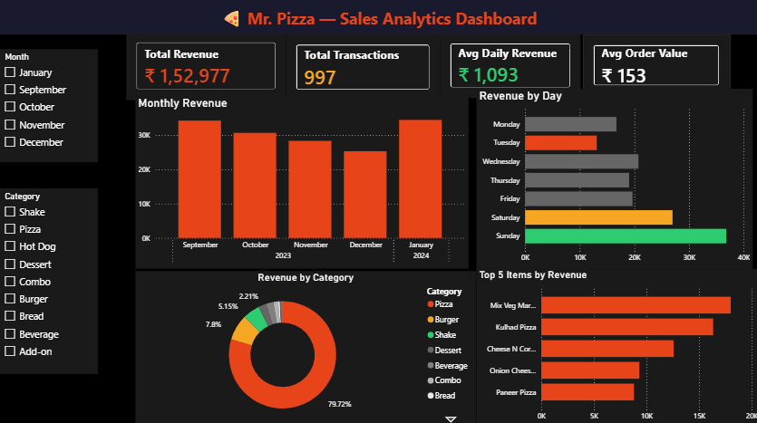

# 🍕 Mr. Pizza - Sales Analytics & Forecasting
 
> BDM Capstone Project · IIT Madras · BS Data Science  
 
---
 
## 🌐 Live Project Website
**[lakshika0408.github.io/mr-pizza-bdm-project](https://lakshika0408.github.io/mr-pizza-bdm-project)**
 
---
 
## 📊 Power BI Dashboard
 

 
> Interactive dashboard with Month and Category slicers - download the `.pbix` file to explore.  
> [📥 Download Power BI Dashboard](Mr_Pizza_Sales_Dashboard.pbix)
 
---
 
## 📌 Project Overview
 
End-to-end sales analytics project for **Mr. Pizza**, a single-operator B2C pizza outlet in Kathgodam, Uttarakhand run by Mr. Prakash Singh Danu. Data collected from handwritten sales notebooks covering 5 months of operation (Sep 2023 - Jan 2024).
 
The project identifies three core business problems - no demand forecasting, no inventory system, and no pattern insight and provides data-backed recommendations implementable without any software.
 
---
 
## 📂 Dataset
 
| Property | Value |
|---|---|
| Source | Primary - handwritten sales notebook |
| Period | Sep 2023 – Jan 2024 |
| Transactions | 997 rows |
| Trading Days | 139 days |
| Unique Items | 47 SKUs |
| Categories | 9 product categories |
| Total Revenue | ₹1,52,977 |
 
**Columns:** Date, Day, Category, Item, Size, Qty, UnitPrice, TotalPrice, DailyTotal, Notes
 
---
 
## 🔍 Key Findings
 
1. **Revenue declined 26.1%** from Sep (₹34,231) to Dec (₹25,310) - a cumulative drop of ₹8,921 with no forecasting system to anticipate it
2. **January surged +36.1%** to ₹34,443 - highest recorded month, driven partly by one outlier catering event (₹7,425 in a single day)
3. **12 items drive 69.2% of revenue** (₹1,05,854) - yet all 47 items treated equally in procurement
4. **Sunday = 24.1% of weekly revenue** - 2.8× more than Tuesday (8.6%), a structural gap with no demand stimulation strategy
5. **CV of 78%** - extreme day-to-day volatility makes flat average useless for procurement decisions
6. **Seasonal indices:** Oct −4.5%, Nov +2.7%, Dec −7.3%, Jan −10.4% (caution, not uplift)
---
 
## 🛠️ Methods Used
 
### 1. MA4 Time-Series Forecasting
`MA4(t) = [R(t) + R(t−1) + R(t−2) + R(t−3)] ÷ 4`
 
Applied to 23 weeks of data. Chosen over ARIMA/Exponential Smoothing because only 5 months of data are available. Directly computable by the owner in a notebook without software.
 
### 2. ABC Inventory Classification
`Cumulative Share(k) = Σ Share(i) for i=1 to k`
 
- **Class A** (≤70%): 12 items → always in stock, 2-day buffer → ₹1,05,854 revenue
- **Class B** (≤90%): 9 items → weekly review → ₹31,044 revenue
- **Class C** (>90%): 26 items → order on demand only → ₹16,079 revenue
### 3. Day-of-Week Pattern Analysis
`Day_Share(d) = R(d) ÷ Σ R(all days) × 100%`
 
Weekend days generate 79% more revenue per day than weekdays (₹31,885 vs ₹17,841).
 
---
 
## 📋 Recommendations
 
| # | Problem | Recommendation | Expected Impact |
|---|---|---|---|
| R1 | Forecasting | MA4 procurement rule every Friday | Save ₹3–5K/month in wastage |
| R2 | Inventory | Class A stocking - 7 core ingredients, 2-day buffer | Protect ₹1,05,854 Class A revenue |
| R3 | Inventory | Stop pre-stocking 26 Class C items | Immediate cash flow relief |
| R5 | Forecasting | Seasonal adjustments (Dec −7.3%, Jan −10.4%) | Protect revenue during slow months |
| R6 | Retention | Tuesday combo - Kulhad Pizza + Cold Drink at ₹109 | +₹520/month Tuesday uplift |
| R7 | Retention | WhatsApp contact collection - 100+ in 3 months | Direct retention channel |
 
**Total projected 5-month impact: ~₹20,000–22,000 (≈13–14% of observed revenue)**
 
---
 
## 🗄️ SQL Analysis
 
20 queries across 5 sections. Key techniques used:
 
- `LAG()` window function for MoM change calculation
- `SUM() OVER()` cumulative window for ABC classification
- `ROWS BETWEEN 3 PRECEDING AND CURRENT ROW` for MA4 forecasting
- `RANK()` for top item identification
- `CASE WHEN` with subqueries for ABC class assignment
 
---
 
## 📈 Descriptive Statistics
 
| Statistic | Daily Revenue | Unit Price | Line Total |
|---|---|---|---|
| Mean | ₹1,100.55 | ₹103 | ₹153 |
| Median | ₹923 | ₹79 | ₹110 |
| Std Dev | ₹853.56 | — | — |
| CV | 78% | — | — |
| Min | ₹189 | ₹5 | ₹5 |
| Max | ₹7,425 | ₹370 | ₹7,425 |
 
---
 
## 🛠️ Tools Used
 
| Tool | Purpose |
|---|---|
| Excel | Data entry, SUMIF/COUNTIF formulas, analytics sheet |
| SQL / SQLite | 20 analytical queries, window functions |
| Power BI | Interactive dashboard with slicers |
| Chart.js | Website visualizations |
| HTML / CSS | Project portfolio website |
 
---
 
## 📁 Repository Structure
 
```
mr-pizza-bdm-project/
├── index.html                        ← Live website
├── README.md                         ← This file
├── analysis_queries.sql              ← 20 SQL queries
├── sales.csv                         ← Clean dataset
├── Mr_Pizza_Analysis.xlsx            ← Excel analytics sheet
├── Mr_Pizza_Sales_Dashboard.pbix     ← Power BI dashboard
├── Final_report.pdf                  ← Final BDM report
├── Mid_Term_Report.pdf               ← Mid-term report
├── Proposal_Report.pdf               ← Project proposal
├── Mr_Pizza_Presentation.pptx        ← Presentation slides
└── screenshots/                      ← SQL queries screenshots
```
 
---
 
*Submitted as part of BDM Capstone · IIT Madras · BS Data Science Program*
 
